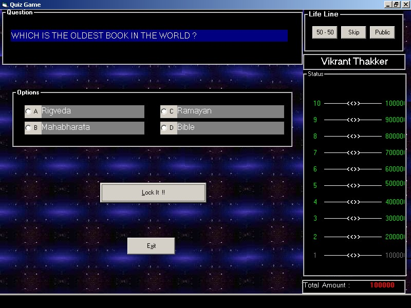



## Complete Quiz Software

### Description

Sooo Muchhhh to Learn... from this software...

Sexy Special Effects, adding music in application,

File Input/Output, APIs, Database Connectivity,

Making Help Files, using Timers and much more...

Guys i have worked very hard.... So dont forget to give excellent rating...;-) Dont forget to read ReadMe.txt for all details...
 
### More Info
 

             |
---                |---
**Submitted On**   |2001-03-23 16:54:12
**By**             |[Vikrant Thakker](https://github.com/Planet-Source-Code/PSCIndex/blob/master/ByAuthor/vikrant-thakker.md)
**Level**          |Intermediate
**User Rating**    |4.5 (136 globes from 30 users)
**Compatibility**  |VB 6\.0
**Category**       |[Complete Applications](https://github.com/Planet-Source-Code/PSCIndex/blob/master/ByCategory/complete-applications__1-27.md)
**World**          |[Visual Basic](https://github.com/Planet-Source-Code/PSCIndex/blob/master/ByWorld/visual-basic.md)
**Archive File**   |[Complete\_Q54294292002\.zip](https://github.com/Planet-Source-Code/vikrant-thakker-complete-quiz-software__1-31650/archive/master.zip)

